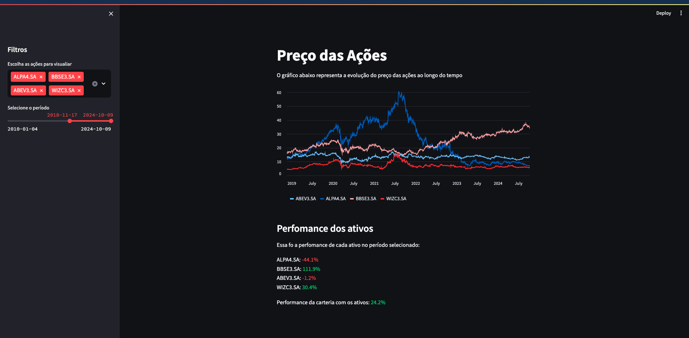

# Dashboard de Ações com Streamlit

Este projeto cria um **dashboard interativo de ações** usando o Streamlit. Ele permite que os usuários visualizem o histórico de preços de ações do mercado brasileiro, selecionem ativos para análise individual e vejam a performance de uma carteira simulada de ativos ao longo do tempo.

   

## Funcionalidades

1. **Seleção de Ações**:
   - O usuário pode selecionar uma ou mais ações a partir de uma lista de ativos do IBOV (Índice Bovespa).
   
2. **Visualização Gráfica**:
   - O app exibe um gráfico interativo que mostra a evolução dos preços dos ativos selecionados ao longo do período definido pelo usuário.

3. **Análise de Performance dos Ativos**:
   - O sistema calcula a performance individual de cada ativo selecionado, mostrando se ele teve uma variação positiva ou negativa no período.
   
4. **Simulação de Carteira**:
   - O app simula uma carteira de investimentos inicializada com R$1000 para cada ativo selecionado e calcula a performance total da carteira ao longo do tempo.

---

## Configuração do Ambiente de Desenvolvimento

### Passo 1: Clonar o Repositório

Clone o repositório do projeto para o seu ambiente local e navegue até o diretório do projeto.

### Passo 2: Criar e Ativar o Ambiente Virtual

Crie um ambiente virtual para isolar as dependências do projeto e ative-o. No macOS/Linux, use o comando `source` para ativar o ambiente. No Windows, use o comando `.\venv\Scripts\activate`.

### Passo 3: Instalar Dependências

Instale todas as dependências necessárias listadas no arquivo `requirements.txt` usando o comando `pip install -r requirements.txt`.

### Passo 4: Aplicar Migrações

Aplique as migrações para configurar o banco de dados com as tabelas definidas nos modelos. Use os comandos `makemigrations` e `migrate`.

### Passo 5: Rodar o Servidor de Desenvolvimento

Inicie o servidor de desenvolvimento para testar a aplicação localmente. Use o comando `streamlit run main.py `.
